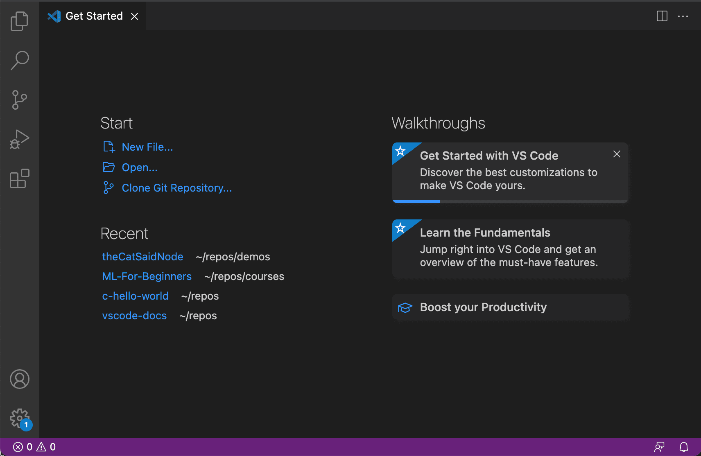
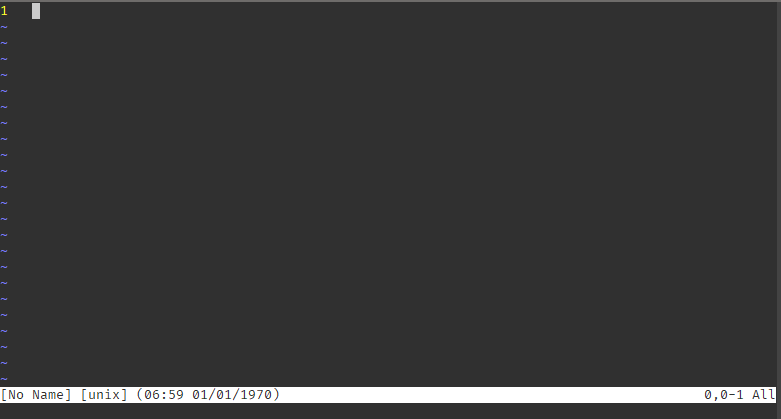
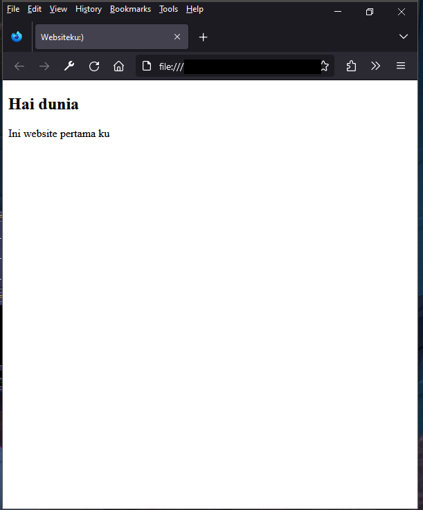
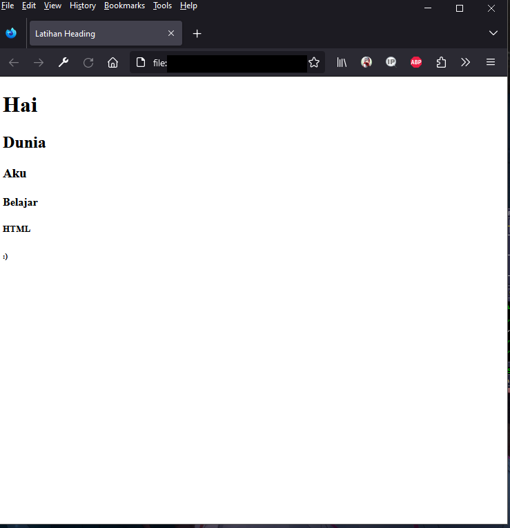

# Web Development Untuk Pemula

## Awal Kata

Buku ini hanya untuk pemula yang tidak tau mulai dari mana. Untuk melatih skill web development Anda, Anda harus berlatih dan mencari ilmu di luar daripada mengandalkan buku ini saja. Jadi, buku ini sebagai batu loncatan bukan sebagai buku "From Nubby To Pro" karena tips dan trik biasanya dapat dari lapangan atau orang yang sudah pernah melakukannya dan tambahan buku ini ter-inspirasi [w3schools.com](https://w3schools.com) jadi jangan lupa untuk dicek.

Belajar tentang pemrograman seperti `Web Development` ini tidak langsung bisa membuat Anda membuat sesuatu yang sangat keren, tetapi anda bisa membuat sesuatu yang setidaknya sedikit keren. Anda harus banyak berlatih, melakukan eksperimen, membaca artikel, bertanya kepada orang lain yang memiliki pengalaman, dan jangan lupa YouTube, YouTube merupakan sarana pembelajaran terbaik untuk orang yang jarang membaca.

## Metode Pembelajaran

Metode pembelajaran yang dipakai oleh buku ini adalah materi, latihan mandiri, dan beberapa poin terdapat project khusus yang harus dikerjakan.

## Daftar isi

1. [Pemilihan Text Editor](#pemilihan-text-editor)
2. [Pengenalan HTML](#pengenalan-html)
    - [Apa itu HTML?](#apa-itu-html)
        - [Asal Muasal HTML](#asal-muasal-html)
        - [Kegunaan HTML](#kegunaan-html)
        - [Contoh HTML](#contoh-html)
    - [Dasar HTML](#dasar-html)
        - [Peralatan yang Dibutuhkan](#peralatan-yang-dibutuhkan)
        - [HTML Pertamamu](#html-pertamamu)
            - [Element `<!DOCTYPE html>`](#element-doctype-html)
            - [Element `<html>`](#element-html)
            - [Element `<title>`](#element-title)
            - [Element `<head>`](#element-head)
            - [Element `<body>`](#element-body)
        - [Struktur _Element_](#struktur-element)
        - [Komentar](#komentar)
        - [Judul/Heading](#judul--heading)
            - [Penjelasan dan Kegunaan Heading](#penjelasan-dan-kegunaan-heading)
            - [Latihan Membuat Heading](#latihan-membuat-heading)
        - [Paragraf](#paragraf)
            - [Penjelasan dan Kegunaan Paragraf](#penjelasan-dan-kegunaan-paragraf)
            - [Latihan Membuat Paragraf](#latihan-membuat-paragraf)
            - [Project Halaman Data Diri](#project-halaman-data-diri)
        - [Formatting](#formatting)
            - [Memiringkan Teks](#memiringkan-teks)
            - [Menebalkan Teks](#menebalkan-teks)
            - [Membuat Teks Menjadi Kecil](#membuat-teks-menjadi-kecil)
            - [Warna Teks](#warna-teks)
            - [Latihan Formatting](#latihan-formatting)
        - [List/Daftar](#list--daftar)
            - [Kegunaan List](#kegunaan-list)
            - [Latihan List](#latihan-daftar)
        - [Link](#link)
            - [Penjelasan, Kegunaan dan Fitur Link](#penjelasan-kegunaan-dan-fitur-link)
            - [Latihan Membuat Link](#latihan-membuat-link)
        - [Tombol](#tombol)
            - [Kegunaan Tombol](#kegunaan-tombol)
            - [Latihan Membuat Tombol](#latihan-membuat-tombol)
        - [Tabel](#tabel)
            - [Kegunaan Tabel](#kegunaan-tabel)
            - [Latihan Tabel](#latihan-tabel)
            - [Project Halaman Daftar Film Bioskop](#project-halaman-daftar-film-bioskop)
        - [Mengambil Masukan Pengguna dengan Form dan Input](#mengambil-masukan-pengguna-dengan-dengan-form-dan-input)
            - [Aturan Form](#aturan-form)
            - [Kegunaan Input](#kegunaan-input)
            - [Macam-Macam Jenis Input](#macam-macam-jenis-input)
            - [Project Halaman Login](#project-halaman-login)
        - [Pengelompokan dengan `<div>`](#pengelompokan-dengan-div)
            - [Latihan Tabel](#latihan-tabel)
            - [Kegunaan Pengelompokan](#kegunaan-pengelompokan)
            - [Latihan Pengelompokan](#latihan-pengelompokan)
        - [Memberi Icon di Tab Browser Kita](#memberi-icon-di-tab-browser-kita)
            - [Latihan Memberi Icon di Tab Browser](#latihan-memberi-icon-di-tab-browser)
        - [Project HTML](#project-html)
            - [Membuat Artikel](#membuat-artikel)
            - [Membuat Formulir Pemesanan Barang](#membuat-formulir-pemesanan-barang)
    - [HTML Tingkat Menengah](#html-tingkat-menengah)
        - [Konsep Semantic HTML](#konsep-semantic-html)
            - [Section](#section)
            - [Navigation](#navigation)
            - [Footer](#footer)
            - [Latihan Semantic HTML](#latihan-semantic-html)
        - [Multimedia](#multimedia)
            - [Konsep filepath](#konsep-filepath)
            - [Gambar](#gambar)
            - [Video](#video)
            - [Audio](#video)
            - [Embedding Situs YouTube](#embedding-situs-youtube)
            - [Latihan Multimedia](#latihan-multimedia)
        - [Aturan Internasional HTML](#aturan-internasional-html)
        - [Project HTML Tingkat Menengah](#project-html-tingkat-menengah)
            - [Membuat Halaman Blog Sederhana](#membuat-halaman-blog-sederhana)
3. [Pengenalan CSS](#pengenalan-css)
    - [Apa itu CSS?](#apa-itu-css)
        - [Asal Muasal CSS](#asal-muasal-css)
        - [Kegunaan CSS](#kegunaan-css)
        - [Contoh CSS](#contoh-css)
    - [Dasar CSS](#dasar-css)
        - [Peralatan yang Dibutuhkan](#peralatan-yang-dibutuhkan-1)
        - [CSS Pertamamu](#CSS-pertamamu)
        - [Konsep CSS Selector](#konsep-selektor)
            - [Element Selector](#element-selector)
            - [Class Selector](#class-selector)
        - [Komentar](#komentar)
        - [Pewarnaan dengan CSS](#perwanaan-dengan-css)
            - [Memberi Warna Teks](#memberi-warna-teks)
            - [Memberi Warna Background](#memberi-warna-background)
            - [Latihan Memberi warna](#latihan-memberi-warna)
        - [Formatting](#formatting-1)
            - [Menganti Font Family](#menganti-font-family)
            - [Menganti Ukuran Font](#menganti-ukuran-font)
            - [Memiringkan Teks](#memiringkan-teks-1)
            - [Menebalkan Teks](#menebalkan-teks-1)
            - [Memberi Bayangan pada teks](#memberi-bayangan-pada-teks)
            - [Latihan Formatting](#latihan-formatting-1)
        - [Memberi Background Terhadap Element HTML](#member-background-terhadap-element-html)
            - [Menggunakan Warna Sebagai Background](#menggunakan-warna-sebagai-background)
            - [Menggunakan Gambar Sebagai Background](#menggunakan-gambar-sebagai-background)
        - [Memberi Bayangan Terhadap Element HTML](#memberi-bayangan-terhadap-element-html)
            - [Kegunaan Bayangan Element HTML](#kegunaan-bayangan-element-html)
            - [Latihan Menerapkan Bayangan pada Element](#latihan-menerapkan-bayangan-pada-element)
        - [Memberi Ruang Antara element](#memberi-ruang-antara-element)
            - [Konsep Box Model](#konsep-box-model)
            - [Margin](#margin)
            - [Padding](#padding)
            - [Latihan Menerapkan Ruang Antara Element](#latihan-menerapkan-ruang-antara-element)
        - [Mengatur Ukuran Suatu Element](#mengatur-ukuran-suatu-element)
        - [Mengatur Garis Pembatas untuk Element](#mengatur-garis-pembatas-untuk-element)
            - [Bentuk Garis Pembatas](#bentuk-garis-pembatas)
            - [Menerapkan Border Element agar Tidak Terlalu Tajam](#menerapkan-border-element-agar-tidak-tajam)
            - [Latihan Membuat Kartu Informasi Sederhaha](#latihan-membuat-kartu-informasi-sederhana)
        - [Konsep Layout Sederhana Menggunakan Flex](#konsep-layout-sederhana-menggunakan-flex)
            - [Mengatur Flex](#mengatur-flex)
            - [Layout Konten Sejajar](#layout-konten-sejajar)
            - [Layout Konten di Tengah](#layout-konten-ditengah)
            - [Latihan Layout Menggunakan Flex](#latihan-layout-menggunakan-flex)
        - [Memisahkan Kode CSS dengan HTML](#memisahkan-kode-css-dengan-html)
        - [Project CSS](#-project-css)
            - [Membuat Data Data yang Keren](#membuat-data-diri-yang-keren)
            - [Membuat Halaman Login](#membuat-halaman-login)
    - [CSS Tingkat mengengah](#css-tingkat-menengah)
        - [Pendalaman CSS Selektor](#pendalaman-css-selektor)
            - [ID Selector](#id-selector)
            - [Attribute Selector](#attribute-selector)
            - [Combinator Selector](#combinator-selector)
            - [Universal Selector](#universal-selector)
            - [Latihan CSS Selektor](#latihan-css-selektor)
        - [Membuat Variabel di CSS](#membuat-variabel-di-css)
        - [Menganti Font Family Menggunakan Google Font](#menganti-font-family-menggunakan-google-font)
        - [Membuat Animasi Sederhana](#membuat-sederhana-animasi)
        - [Membuat Tombol Navigasi](#membuat-tombol-navigasi)
        - [Membuat Halaman Telihat Bagus di Berbagai Perangkat](#membuat-halaman-terlihat-bagus-di-berbagai-perangkat)
        - [Bootstrap](#bootstrap)
        - [Project CSS tingkat menengah](#project-css-tingkat-menengah)
            - [Membuat Blog](#membuat-blog)
4. [Pengenalan JavaScript](#pengenalan-javascript)
    - [Apa Itu JavaScript?](#apa-itu-javascript)
        - [Asal Muasal JavaScript](#asal-muasal-javascript)
        - [Kegunaan JavaScript](#kegunaan-javascript)
        - [Contoh JavaScript](#contoh-javascript)
    - [Dasar JavaScript](#dasar-javascript)
        - [Peralatan yang Dibutuhkan](#peralatan-yang-dibutuhkan-2)
        - [Javascript Pertamamu](#javascript-pertamamu)
            - [Penjelasan dari `console.log`](#penjelasan-dari-consolelog)
            - [Penjelasan dari `document.write`](#penjelasan-dari-documentwrite)
            - [Penjelasan dari `alert`](#penjelasan-dari-alert)
            - [Membuka Developer Tools Browser](#membuka-developer-tools-browser)
        - [Komentar](#komentar)
        - [Memisahkan Kode JavaScript Menjadi File Tersendiri](#memisahkan-kode-javascript-menjadi-file-tersendiri)
        - [Tipe Data di JavaScript](#tipe-data-di-javascript)
            - [String](#string)
            - [Char](#char)
            - [Number](#number)
            - [Bool](#bool)
            - [Object](#object)
        - [Melakukan Operasi Matematika](#melakukan-operasi-matematika)
        - [Membuat Variabel](#membuat-variabel)
            - [var](#var)
            - [let](#let)
            - [const](#const)
            - [Menganti Konten Variabel](#menganti-dengan-variabel)
            - [Latihan Melakukan Operasi Matematika Dengan mariabel](#latihan-melakukan-operasi-matematika-dengan-variabel)
        - [Menjalankan Kode dengan Kondisi](#menjalankan-kode-dengan-kondisi)
            - [Manfaat Dari Menjalankan Beberapa Kode Dengan Kondisi Tertentu](#manfaat-dari-menjalankan-beberapa-kode-dengan-kondisi-tertentu)
            - [if-statement](#if-statement)
            - [switch-statement](#switch-statement)
            - [Latihan Membuat Konverter Nilai Menjadi Huruf](#latihan-membuat-konverter-nilai-menjadi-huruf)
        - [Perulangan](#perulangan)
            - [while-loop](#while-loop)
            - [for-loop](#for-loop)
            - [Membuat Segitiga dengan Looping](#membuat-segitiga-dengan-looping)
        - [Konsep Scope](#konsep-scope)
        - [Array](#array)
    - [JavaScript Tingkat Menengah](#javascript-tingkat-menengah)
        - [Konsep Exception di JavaScript](#konsep-exception-di-javascript)
        - [Function](#function)
            - [Manfaat Function](#manfaat-function)
            - [Latihan Membuat Function Mengkuadratkan Angka](#latihan-membuat-function-mengkuadratkan-angka)
        - [Class](#class)
            - [Manfaat Class](#manfaat-class)
            - [Latihan Membuat Class](#latihan-membuat-class)
        - [Konsep DOM](#konsep-dom)
            - [Apa itu DOM](#apa-itu-dom)
            - [DOM Element](#dom-element)
            - [Menambah HTML Secara Dinamis dengan DOM](#menambah-html-secara-dinamis-dengan-dom)
            - [Konsep Event di DOM](#konsep-event-di-dom)
            - [Latihan DOM dan Event](#latihan-dom-dan-event)
        - [Project JavaScript Tingkat Menengah](#project-javascript-tingkat-menengah)
            - [Membuat Halaman Login](#membuat-halaman-login-1)
5. [Penutup](#penutup)

## [Pemilihan Text Editor](#daftar-isi)

Sebelum kita memulai belajar web development kita harus memilih text editor kita, ini akan tergantung dengan sistem operasi yang kalian pakai dan bahasa pemrograman yang dipelajari, saya ada beberapa list text editor yang cocok untuk web development, mengapa harus memakai text editor karena kita akan mengetik suatu web dan jarang akan menyentuh aplikasi yang bisa melakukan _Drag and Drop_.

### 1. [Visual Studio Code](https://code.visualstudio.com)



Visual Studio Code atau sering dijuluki VSCode adalah suatu text editor yang berbasis _Chromium_ dan dapat di kostumisasi sesuai keinginan dan bisa menjadi _IDE_ (Integrated Development Enviroment), karena berbasis _Chromium_ saya tidak akan rekomendasikan ini untuk  anda jika anda hanya memiliki _RAM_ yang sangat tipis, tapi kalau anda mempunya _RAM_ seperti 4GB saya rekomendasikan. VSCode ini bisa di-install di Windows, Linux, dan MacOS, saya rekomendasikan ini tetapi kalau punya _RAM_ yang lumayan.

Untuk yang tidak tau _IDE_ itu suatu aplikasi yang membantu dan mempercepat kita dalam melakukan development.

### 2. Notepad


Notepad suatu aplikasi yang dibuat oleh Microsoft untuk mencatat, tetapi bisa dibuat untuk membuat web, aplikasi ini terdapat hampir seluruh sistem operasi Windows, tetapi aplikasi tidak bisa di kostumisasi dan Notepad ini bukan _IDE_, jadi ekspek nanti sedikit sulit, jadi saya tidak akan rekomendasikan ini untuk rencana panjang belajar web development tetapi untuk pertama kali bisa dicoba.

### 3. VI / VIM (VI Improved)



VIM merupakan aplikasi yang open source yang dibuat oleh komunitas, aplikasi ini sering dijumpai di sistem operasi linux, aplikasi ini dapat di kostumisasi tetapi susah akan pakainya jika belum pernah mengetik tanpa menyentuh mouse, jadi kalau sudah biasa saya bisa rekomendasikan ke anda, kalau tidak anda pilih [Visual Studio Code](#1-visual-studio-code) saja

### Note

Untuk selanjutnya saya akan asumsikan anda sedikit familiar dengan text editor yang anda pilih, dan buku ini akan memberikan contoh memakai [Visual Studio Code](#1-visual-studio-code) dan berasumsi anda juga memakainya juga.

## [Pengenalan HTML](#daftar-isi)

### [Apa itu HTML?](#daftar-isi)

HTML atau HyperText Markup Langauge merupakan markup yang telah distandarisasi untuk menampilkan konten di browser. Browser akan menerima dokumen HTML dari [_server_]() atau dari file lokal lalu ditampilkan ke browser. HTML ini disimpan dengan bentuk file extensi `.html`.

HTML juga dapat menyematkan program yang ditulis dalam bahasa skrip seperti JavaScript yang dapat membuat konten halaman web lebih menarik, dan juga dapat memasukan CSS untuk mengatur tata letak konten.

Element merupakan dasar utama dalam HTML yang digunakan untuk menampilkan konten di suatu web browser.

#### Asal Muasal HTML

Pada tahun 1980 seorang ahli fisika, Tim Berners-Lee, dan juga seorang kontraktor di CERN (Organisasi Eropa untuk Riset Nuklir) mengusulkan dan menyusun ENQUIRE, sebuah sistem untuk ilmuwan CERN dalam membagi dokumen. Sembilan tahun kemudian, Berners-Lee mengusulkan adanya sistem markah berbasis internet. Berners-Lee menspesifikasikan HTML dan menulis jaringan beserta perangkat lunaknya di akhir 1990. Pada tahun yang sama, Berners-Lee dan Robert Cailliau, insinyur sistem data CERN berkolaborasi dalam sebuah permintaan untuk pendanaan, namun tidak diterima secara resmi oleh CERN. Di catatan pribadinya sejak 1990 dia mendaftar "beberapa dari banyak daerah yang menggunakan hypertext" dan pertama-tama menempatkan sebuah ensiklopedia.

#### Kegunaan HTML

Fungsi utama HTML ialah membangun tampilan halaman website khususnya dibagian _Frontend_.

#### Contoh HTML

Terdapat contoh yang paling sederhana dan anda bisa coba experimen, ingat filenya harus berformat `.html` agar bisa dibuka di browser, jangan takut saya akan menjelaskannya pelan pelan di bab berikutnya.

```html
<!DOCTYPE html>
<html lang="en">
<head>
    <title>Websiteku:)</title>
</head>
<body>
    <h2>Hai dunia</h2>
    <p>Ini website pertama ku</p>
</body>
</html>
```

Kalau sudah di save dengan format `.html` lalu seret file tersebut ke browser, lalu muncul seperti ini, kalau sama berarti selamat anda berhasil membuat website pertama anda.



### [Dasar HTML](#daftar-isi)

#### Peralatan yang dibutuhkan

- Text Editor (VSCode, VIM, Notepad)
- Web Browser (Firefox, Microsoft Edge, Chrome)
- Internet (Opsional)

#### HTML Pertamamu

Ini merupakan HTML yang tadi anda buat, kalau belum anda buat anda harus segera melakukannya, untuk mengulang file-nya harus berformat `.html` dan di _Drag and Drop_ ke browser untuk melihatnya.

```html
<!DOCTYPE html>
<html lang="en">
<head>
    <title>Websiteku:)</title>
</head>
<body>
    <h2>Hai dunia</h2>
    <p>Ini website pertama ku</p>
</body>
</html>
```

##### Element `<!DOCTYPE html>`

Element `<!DOCTYPE html>` ini menandakan bahwa file text ini merupakan file HTML, ini sangat penting karena ini memberitahu kepada web browser tanpa harus diberitahu oleh [_server_]().

##### Element `<html>`

Element `<html>` merupakan induk dari semua element HTML di dokumen HTML, element lain seperti `<h2>` harus didalamnya `<html>` contohnya.

Yang salah

```html
<!DOCTYPE html>

<h2>Halo</h2>

<html lang="en">
<head>
    <title>Websiteku:)</title>
</head>
<body>
    <h2>Hai dunia</h2>
    <p>Ini website pertama ku</p>
</body>
</html>
```

Element ini juga menerima _Attribute_ `lang` untuk menandakan bahasa apa yang digunakan di dokumen HTML, _Attribute_ akan dijelaskan dibagian [Struktur _Element_](#struktur-element).

##### Element `<title>`

Element `<title>` merupakan element untuk memberi nama suatu halaman website, element ini termasuk dengan metadata atau informasi penting disuatu halaman website, dan harus diletak-kan didalam `<head>`, kalau kurang jelas dibawah ini ada gambar contoh dimana nama suatu halaman website.


##### Element `<head>`

Element `<head>` merupakan element yang menyimpan semua metadata atau informasi penting disuatu halaman website, contoh `<title>`, `<script>` untuk JavaScript, atau CSS (Nanti akan dijelaskan lebih dalam di bab CSS).

##### Element `<body>`

Element `<body>` merupakan element yang menyimpan semua konten HTML seperti `<p>`, `<h2>`, dll.

#### [Struktur Element](#daftar-isi)

Element memiliki berbagai bagian, mulai dari tag, attribute, id, dan class, sebenarnya id dan class itu attribute tetapi mereka adalah hal yang istimewa dan nanti diselanjutnya kita akan sering memakainya, untuk saat ini bisa id, dan class bisa diabaikan terlebih dahulu.

```html
<p>
    Lorem ipsum
</p>
```

`<p>` merupakan tag pembuka dan `</p>` merupakan tag penutup.

```html
<html lang='en'>
</html>
```

`lang` merupakan attribute dan `en` merupakan isi dari attribute tersebut.

```html
<p id='some'>Something</p>
```

Pasti sudah jelas ya `id` merupakan id dan `some` merupakan konten `id`, `id` sering digunakan untuk memberi nama unik kepada element HTML, `id` ini masih termasuk dengan attribute.

```html
<p class="red">something</p>
<p class="red something">something</p>
```

Pasti sudah jelas ya hampir mirip dengan yang `id`, bedanya tidak harus unik dengan element lain dan juga bisa memiliki isi lebih dari satu dengan spasi sebagai pemisah.

Element HTML dapat memiliki attribute, id, dan class tetapi tidak boleh memiliki attribute yang sama semisal ada element memiliki 2 attribute yang namanya sama itu tidak boleh tetapi kalau misal attribute yang pertama `lang` dan attribute kedua `aria-label` itu tidak apa apa.

#### [Komentar](#daftar-isi)

Seluruh bahasa pemrograman pasti memiliki komentar, komentar ini digunakan untuk memberikan informasi lebih lanjut dari potongan skrip/kode, dan HTML juga memiliki fitur ini walaupun dia markup bukan bahasa pemrograman. Untuk membuat komentar di HTML anda harus mengetik `<!---` di awal baris dan lalu ditengahnya konten yang anda ingin tulis lalu diakhiri dengan `--->` tetapi bisa ditulis di baris berikutnya untuk membuat komentar multi baris, contohnya seperti ini.

```html
<!DOCTYPE html>

<html lang="en">
<head>
    <title>Websiteku:)</title>
</head>
<body>
    <!-- Ini tidak akan ditampilkan di browser -->
    <h2>Hai dunia</h2>
    <p>Ini website pertama ku</p>
    <!-- Ini
    Juga
    Tidak
    Akan
    Ditampilkan -->
</body>
</html>
```

#### [Judul/Heading](#daftar-isi)

##### Penjelasan dan Kegunaan Heading

Judul atau sering disebut Heading merupakan element HTML yang digunakan untuk konten judul, element ini ada 6 jenis dan itu hanya merubah angkanya saja, mulai dari yang paling besar `<h1>` sampai `<h6>` yang terkecil, contohnya seperti ini.

```html
<!DOCTYPE html>

<html lang="en">
<head>
    <title>Contoh Heading</title>
</head>
<body>
    <h1>Judul</h1>
    <h2>Judul</h2>
    <h3>Judul</h3>
    <h4>Judul</h4>
</body>
</html>
```

##### Latihan membuat Heading

Latihan pertama anda membuat contoh seperti yang dibawah ini.



#### [Paragraf](#daftar-isi)

##### Penjelasan dan Kegunaan Paragraf

Sesuai namanya element ini digunakan untuk membuat paragraf, penulisan element paragraf ini sangat sederhana `<p>Konten Kita</p>`, contoh yang paling sederhana sudah ada di bagian [HTML Pertamamu](#html-pertamamu).

##### Latihan membuat paragraf

Latihan kedua anda membuat contoh seperti yang dibawah ini.


##### Project halaman data diri

Project pertama anda adalah membuat halaman web yang berisikan data diri anda seperti nama, alamat, sosial media, dll. Anda boleh berkreasi dengan ilmu yang anda dapat dari materi sebelumnya.

#### [Formatting](#daftar-isi)
