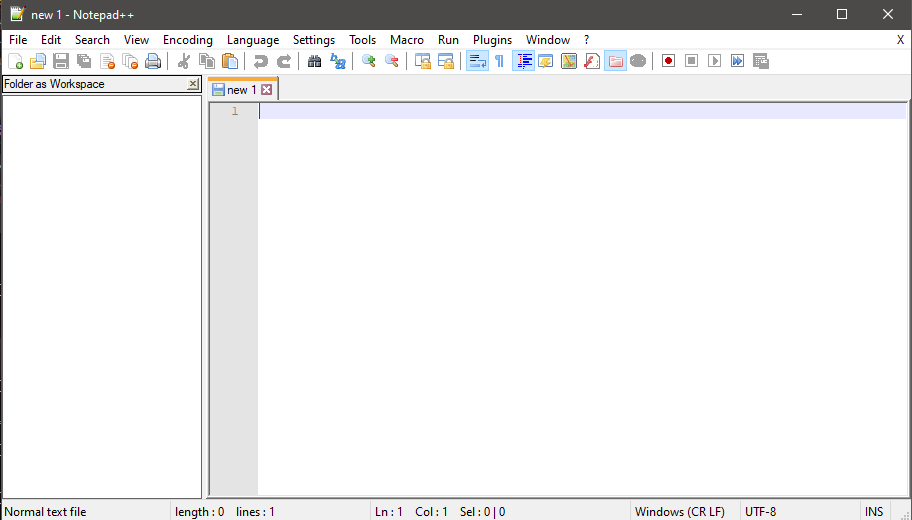
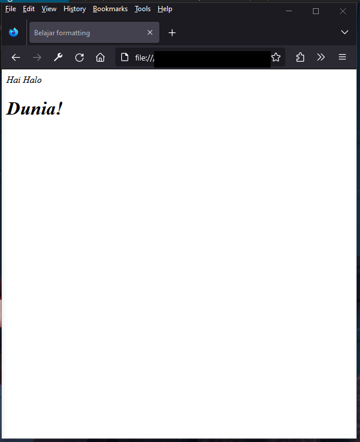
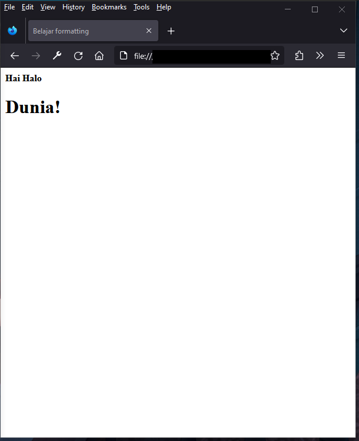
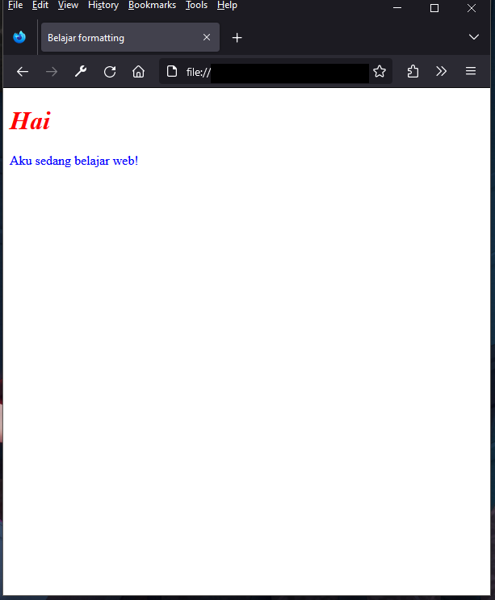
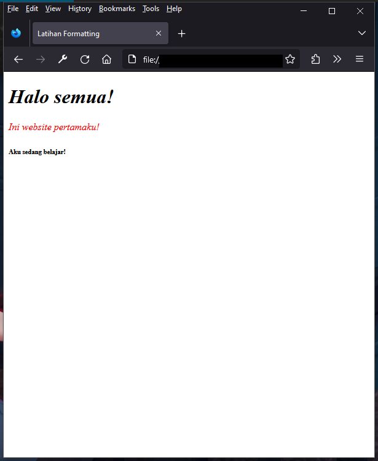
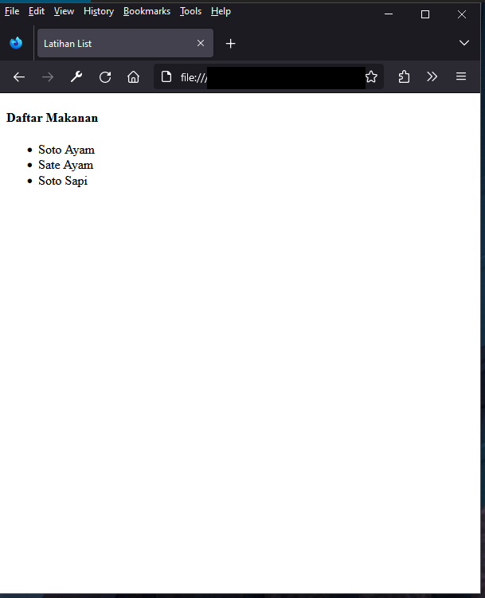
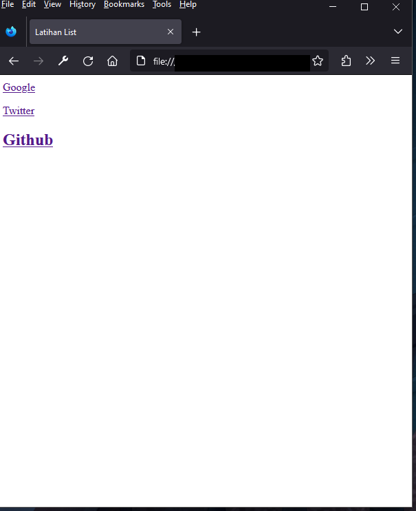
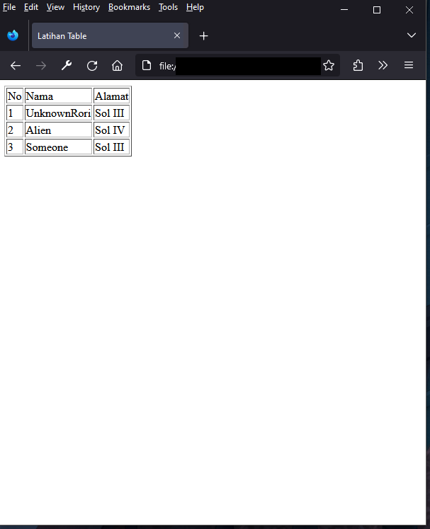
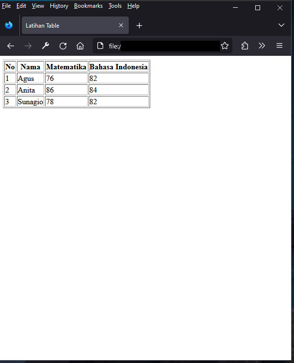
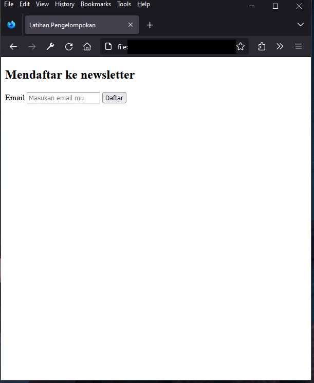

# Web Development Untuk Pemula

## Awal Kata

Buku ini hanya untuk pemula yang tidak tau mulai dari mana. Untuk melatih skill web development Anda, Anda harus berlatih dan mencari ilmu di luar daripada mengandalkan buku ini saja. Jadi, buku ini sebagai batu loncatan bukan sebagai buku "From Nubby To Pro" karena tips dan trik biasanya dapat dari lapangan atau orang yang sudah pernah melakukannya dan tambahan buku ini ter-inspirasi [w3schools.com](https://w3schools.com) jadi jangan lupa untuk dicek.

Belajar tentang pemrograman seperti `Web Development` ini tidak langsung bisa membuat Anda membuat sesuatu yang sangat keren, tetapi anda bisa membuat sesuatu yang setidaknya sedikit keren. Anda harus banyak berlatih, melakukan eksperimen, membaca artikel, bertanya kepada orang lain yang memiliki pengalaman, dan jangan lupa YouTube, YouTube merupakan sarana pembelajaran terbaik untuk orang yang jarang membaca.

## Metode Pembelajaran

Metode pembelajaran yang dipakai oleh buku ini adalah materi, latihan mandiri, dan beberapa poin terdapat project khusus yang harus dikerjakan.

## Daftar isi

1. [Pemilihan Text Editor](#pemilihan-text-editor)
2. [Pengenalan HTML](#pengenalan-html)
    - [Apa itu HTML?](#apa-itu-html)
        - [Asal Muasal HTML](#asal-muasal-html)
        - [Kegunaan HTML](#kegunaan-html)
        - [Contoh HTML](#contoh-html)
    - [Dasar HTML](#dasar-html)
        - [Peralatan yang Dibutuhkan](#peralatan-yang-dibutuhkan)
        - [HTML Pertamamu](#html-pertamamu)
            - [Element `<!DOCTYPE html>`](#element-doctype-html)
            - [Element `<html>`](#element-html)
            - [Element `<title>`](#element-title)
            - [Element `<head>`](#element-head)
            - [Element `<body>`](#element-body)
        - [Struktur _Element_](#struktur-element)
        - [Komentar](#komentar)
        - [Judul/Heading](#judulheading)
            - [Penjelasan dan Kegunaan Heading](#penjelasan-dan-kegunaan-heading)
            - [Latihan Membuat Heading](#latihan-membuat-heading)
        - [Paragraf](#paragraf)
            - [Penjelasan dan Kegunaan Paragraf](#penjelasan-dan-kegunaan-paragraf)
            - [Latihan Membuat Paragraf](#latihan-membuat-paragraf)
            - [Project Halaman Data Diri](#project-halaman-data-diri)
        - [Formatting](#formatting)
            - [Memiringkan Teks](#memiringkan-teks)
            - [Menebalkan Teks](#menebalkan-teks)
            - [Membuat Teks Menjadi Kecil](#membuat-teks-menjadi-kecil)
            - [Warna Teks](#warna-teks)
            - [Latihan Formatting](#latihan-formatting)
        - [List/Daftar](#listdaftar)
            - [Penjelasan dan Kegunaan List](#penjelasan-dan-kegunaan-list)
            - [Ordered List](#ordered-list)
            - [Unordered List](#unordered-list)
            - [Latihan List](#latihan-list)
        - [Link](#link)
            - [Penjelasan, Kegunaan dan Fitur Link](#penjelasan-kegunaan-dan-fitur-link)
            - [Latihan Membuat Link](#latihan-membuat-link)
        - [Tombol](#tombol)
            - [Penjelasan dan Kegunaan Tombol](#penjelasan-dan-kegunaan-tombol)
            - [Latihan Membuat Tombol](#latihan-membuat-tombol)
        - [Tabel](#tabel)
            - [Penjelasan dan Kegunaan Table](#penjelasan-dan-kegunaan-table)
            - [Latihan Tabel](#latihan-tabel)
            - [Project Halaman Daftar Film Bioskop](#project-halaman-daftar-film-bioskop)
        - [Mengambil Masukan Pengguna dengan Form dan Input](#mengambil-masukan-pengguna-dengan-form-dan-input)
            - [Aturan Form](#aturan-form)
            - [Kegunaan Input](#kegunaan-input)
            - [Macam-Macam Jenis Input](#macam-macam-jenis-input)
            - [Project Halaman Login](#project-halaman-login)
        - [Pengelompokan dengan `<div>`](#pengelompokan-dengan-div)
            - [Penjelasan dan Kegunaan Pengelompokan](#penjelasan-dan-kegunaan-pengelompokan)
            - [Latihan Pengelompokan](#latihan-pengelompokan)
        - [Memberi Icon di Tab Browser Kita](#memberi-icon-di-tab-browser-kita)
            - [Latihan Memberi Icon di Tab Browser](#latihan-memberi-icon-di-tab-browser)
        - [Project HTML](#project-html)
            - [Membuat Artikel](#membuat-artikel)
            - [Membuat Formulir Pemesanan Barang](#membuat-formulir-pemesanan-barang)
    - [HTML Tingkat Menengah](#html-tingkat-menengah)
        - [Konsep Semantic HTML](#konsep-semantic-html)
            - [Section](#section)
            - [Article](#section)
            - [Navigation](#navigation)
            - [Footer](#footer)
            - [Latihan Semantic HTML](#latihan-semantic-html)
        - [Multimedia](#multimedia)
            - [Konsep filepath](#konsep-filepath)
            - [Gambar](#gambar)
            - [Video](#video)
            - [Audio](#video)
            - [Embedding Situs YouTube](#embedding-situs-youtube)
            - [Latihan Multimedia](#latihan-multimedia)
        - [Project HTML Tingkat Menengah](#project-html-tingkat-menengah)
            - [Membuat Halaman Blog Sederhana](#membuat-blog-sederhana)
3. [Pengenalan CSS](#pengenalan-css)
    - [Apa itu CSS?](#apa-itu-css)
        - [Asal Muasal CSS](#asal-muasal-css)
        - [Kegunaan CSS](#kegunaan-css)
        - [Contoh CSS](#contoh-css)
    - [Dasar CSS](#dasar-css)
        - [Peralatan yang Dibutuhkan](#peralatan-yang-dibutuhkan-1)
        - [CSS Pertamamu](#css-pertamamu)
        - [Konsep CSS Selector](#konsep-selektor)
            - [Element Selector](#element-selector)
            - [Class Selector](#class-selector)
        - [Komentar](#komentar)
        - [Pewarnaan dengan CSS](#pewarnaan-dengan-css)
            - [Memberi Warna Teks](#memberi-warna-teks)
            - [Memberi Warna Background](#memberi-warna-background)
            - [Latihan Memberi warna](#latihan-memberi-warna)
        - [Formatting](#formatting-1)
            - [Mengganti Font Family](#mengganti-font-family)
            - [Mengganti Ukuran Font](#mengganti-ukuran-font)
            - [Mengatur Posisi Font](#mengatur-posisi-font)
            - [Memberi Garis Bawah pada Teks](#memberi-garis-bawah-pada-teks)
            - [Memiringkan Teks](#memiringkan-teks-1)
            - [Menebalkan Teks](#menebalkan-teks-1)
            - [Memberi Bayangan pada teks](#memberi-bayangan-pada-teks)
            - [Latihan Formatting](#latihan-formatting-1)
        - [Memberi Background pada Element HTML](#memberi-background-pada-element-html)
            - [Menggunakan Warna Sebagai Background](#menggunakan-warna-sebagai-background)
            - [Menggunakan Gambar Sebagai Background](#menggunakan-gambar-sebagai-background)
        - [Memberi Bayangan pada Element HTML](#memberi-bayangan-pada-element-html)
            - [Latihan Menerapkan Bayangan pada Element](#latihan-menerapkan-bayangan-pada-element)
        - [Mengatur Garis Pembatas pada Element](#mengatur-garis-pembatas-pada-element)
            - [Bentuk Garis Pembatas](#bentuk-garis-pembatas)
            - [Menerapkan Border Element agar Tidak Terlalu Tajam](#menerapkan-border-element-agar-tidak-terlalu-tajam)
            - [Latihan Membuat Kartu Informasi Sederhaha](#latihan-membuat-kartu-informasi-sederhana)
        - [Memberi Ruang Antara element](#memberi-ruang-antara-element)
            - [Konsep Box Model](#konsep-box-model)
            - [Margin](#margin)
            - [Padding](#padding)
            - [Latihan Menerapkan Ruang Antara Element](#latihan-menerapkan-ruang-antara-element)
        - [Mengatur Ukuran Suatu Element](#mengatur-ukuran-suatu-element)
        - [Konsep Layout Sederhana Menggunakan Flex](#konsep-layout-sederhana-menggunakan-flex)
            - [Mengatur Flex](#mengatur-flex)
            - [Layout Konten Sejajar](#layout-konten-sejajar)
            - [Layout Konten di Tengah](#layout-konten-ditengah)
            - [Latihan Layout Menggunakan Flex](#latihan-layout-menggunakan-flex)
        - [Memisahkan Kode CSS dengan HTML](#memisahkan-kode-css-dengan-html)
        - [Project CSS](#-project-css)
            - [Membuat Data Data yang Keren](#membuat-data-diri-yang-keren)
            - [Membuat Halaman Login](#membuat-halaman-login)
    - [CSS Tingkat mengengah](#css-tingkat-menengah)
        - [Pendalaman CSS Selektor](#pendalaman-css-selektor)
            - [ID Selector](#id-selector)
            - [Attribute Selector](#attribute-selector)
            - [Combinator Selector](#combinator-selector)
            - [Universal Selector](#universal-selector)
            - [Latihan CSS Selektor](#latihan-css-selektor)
        - [Membuat Variabel di CSS](#membuat-variabel-di-css)
        - [Menganti Font Family Menggunakan Google Font](#menganti-font-family-menggunakan-google-font)
        - [Membuat Animasi Sederhana](#membuat-sederhana-animasi)
        - [Membuat Tombol Navigasi](#membuat-tombol-navigasi)
        - [Membuat Halaman Telihat Bagus di Berbagai Perangkat](#membuat-halaman-terlihat-bagus-di-berbagai-perangkat)
        - [Bootstrap](#bootstrap)
        - [Project CSS tingkat menengah](#project-css-tingkat-menengah)
            - [Membuat Blog](#membuat-blog)
4. [Pengenalan JavaScript](#pengenalan-javascript)
    - [Apa Itu JavaScript?](#apa-itu-javascript)
        - [Asal Muasal JavaScript](#asal-muasal-javascript)
        - [Kegunaan JavaScript](#kegunaan-javascript)
        - [Contoh JavaScript](#contoh-javascript)
    - [Dasar JavaScript](#dasar-javascript)
        - [Peralatan yang Dibutuhkan](#peralatan-yang-dibutuhkan-2)
        - [Javascript Pertamamu](#javascript-pertamamu)
            - [Penjelasan dari `console.log`](#penjelasan-dari-consolelog)
            - [Penjelasan dari `document.write`](#penjelasan-dari-documentwrite)
            - [Penjelasan dari `alert`](#penjelasan-dari-alert)
            - [Membuka Developer Tools Browser](#membuka-developer-tools-browser)
        - [Komentar](#komentar)
        - [Memisahkan Kode JavaScript Menjadi File Tersendiri](#memisahkan-kode-javascript-menjadi-file-tersendiri)
        - [Tipe Data di JavaScript](#tipe-data-di-javascript)
            - [String](#string)
            - [Char](#char)
            - [Number](#number)
            - [Bool](#bool)
            - [Object](#object)
        - [Melakukan Operasi Matematika](#melakukan-operasi-matematika)
        - [Membuat Variabel](#membuat-variabel)
            - [var](#var)
            - [let](#let)
            - [const](#const)
            - [Menganti Konten Variabel](#menganti-dengan-variabel)
            - [Latihan Melakukan Operasi Matematika Dengan mariabel](#latihan-melakukan-operasi-matematika-dengan-variabel)
        - [Menjalankan Kode dengan Kondisi](#menjalankan-kode-dengan-kondisi)
            - [Manfaat Dari Menjalankan Beberapa Kode Dengan Kondisi Tertentu](#manfaat-dari-menjalankan-beberapa-kode-dengan-kondisi-tertentu)
            - [if-statement](#if-statement)
            - [switch-statement](#switch-statement)
            - [Latihan Membuat Konverter Nilai Menjadi Huruf](#latihan-membuat-konverter-nilai-menjadi-huruf)
        - [Perulangan](#perulangan)
            - [while-loop](#while-loop)
            - [for-loop](#for-loop)
            - [Membuat Segitiga dengan Looping](#membuat-segitiga-dengan-looping)
        - [Konsep Scope](#konsep-scope)
        - [Array](#array)
    - [JavaScript Tingkat Menengah](#javascript-tingkat-menengah)
        - [Konsep Exception di JavaScript](#konsep-exception-di-javascript)
        - [Function](#function)
            - [Manfaat Function](#manfaat-function)
            - [Latihan Membuat Function Mengkuadratkan Angka](#latihan-membuat-function-mengkuadratkan-angka)
        - [Class](#class)
            - [Manfaat Class](#manfaat-class)
            - [Latihan Membuat Class](#latihan-membuat-class)
        - [Konsep DOM](#konsep-dom)
            - [Apa itu DOM](#apa-itu-dom)
            - [DOM Element](#dom-element)
            - [Menambah HTML Secara Dinamis dengan DOM](#menambah-html-secara-dinamis-dengan-dom)
            - [Konsep Event di DOM](#konsep-event-di-dom)
            - [Latihan DOM dan Event](#latihan-dom-dan-event)
        - [Project JavaScript Tingkat Menengah](#project-javascript-tingkat-menengah)
            - [Membuat Halaman Login](#membuat-halaman-login-1)
5. [Penutup](#penutup)

## [Pemilihan Text Editor](#daftar-isi)

Sebelum kita memulai belajar web development kita harus memilih text editor kita, ini akan tergantung dengan sistem operasi yang kalian pakai dan bahasa pemrograman yang dipelajari, saya ada beberapa list text editor yang cocok untuk web development, mengapa harus memakai text editor karena kita akan mengetik suatu web dan jarang akan menyentuh aplikasi yang bisa melakukan _Drag and Drop_.

### 1. [Visual Studio Code](https://code.visualstudio.com)


Visual Studio Code atau sering dijuluki VSCode adalah suatu text editor yang berbasis _Chromium_ dan dapat di kostumisasi sesuai keinginan dan bisa menjadi _IDE_ (Integrated Development Enviroment), karena berbasis _Chromium_ saya tidak akan rekomendasikan ini untuk  anda jika anda hanya memiliki _RAM_ yang sangat tipis, tapi kalau anda mempunya _RAM_ seperti 4GB saya rekomendasikan. VSCode ini bisa di-install di Windows, Linux, dan MacOS, saya rekomendasikan ini tetapi kalau punya _RAM_ yang lumayan.

Untuk yang tidak tau _IDE_ itu suatu aplikasi yang membantu dan mempercepat kita dalam melakukan development.

Download : <https://code.visualstudio.com>

### 2. Notepad


Notepad suatu aplikasi yang dibuat oleh Microsoft untuk mencatat, tetapi bisa dibuat untuk membuat web, aplikasi ini terdapat hampir seluruh sistem operasi Windows, tetapi aplikasi tidak bisa di kostumisasi dan Notepad ini bukan _IDE_, jadi ekspek nanti sedikit sulit, jadi saya tidak akan rekomendasikan ini untuk rencana panjang belajar web development tetapi untuk pertama kali bisa dicoba.

### 3. VI / VIM (VI Improved)


VIM merupakan aplikasi yang open source yang dibuat oleh komunitas, aplikasi ini sering dijumpai di sistem operasi linux, aplikasi ini dapat di kostumisasi tetapi susah akan pakainya jika belum pernah mengetik tanpa menyentuh mouse, jadi kalau sudah biasa saya bisa rekomendasikan ke anda, kalau tidak anda pilih [Visual Studio Code](#1-visual-studio-code) saja

### [Notepad++](https://notepad-plus-plus.org/)



Notepad merupakan apliksi open source yang dibuat komunitas untuk menganti [Notepad](#notepad), aplikasi ini dapat di kostumisasi sesuai selera dan sangat ringan, cocok untuk awal belajar

Download : <https://notepad-plus-plus.org/>

### Note

Untuk selanjutnya saya akan asumsikan anda sedikit familiar dengan text editor yang anda pilih, dan buku ini akan memberikan contoh memakai [Visual Studio Code](#1-visual-studio-code) dan berasumsi anda juga memakainya juga.

## [Pengenalan HTML](#daftar-isi)

### [Apa itu HTML?](#daftar-isi)

HTML atau HyperText Markup Langauge merupakan markup yang telah distandarisasi untuk menampilkan konten di browser. Browser akan menerima dokumen HTML dari [_server_]() atau dari file lokal lalu ditampilkan ke browser. HTML ini disimpan dengan bentuk file extensi `.html`.

HTML juga dapat menyematkan program yang ditulis dalam bahasa skrip seperti JavaScript yang dapat membuat konten halaman web lebih menarik, dan juga dapat memasukan CSS untuk mengatur tata letak konten.

Element merupakan dasar utama dalam HTML yang digunakan untuk menampilkan konten di suatu web browser.

#### Asal Muasal HTML

Pada tahun 1980 seorang ahli fisika, Tim Berners-Lee, dan juga seorang kontraktor di CERN (Organisasi Eropa untuk Riset Nuklir) mengusulkan dan menyusun ENQUIRE, sebuah sistem untuk ilmuwan CERN dalam membagi dokumen. Sembilan tahun kemudian, Berners-Lee mengusulkan adanya sistem markah berbasis internet. Berners-Lee menspesifikasikan HTML dan menulis jaringan beserta perangkat lunaknya di akhir 1990. Pada tahun yang sama, Berners-Lee dan Robert Cailliau, insinyur sistem data CERN berkolaborasi dalam sebuah permintaan untuk pendanaan, namun tidak diterima secara resmi oleh CERN. Di catatan pribadinya sejak 1990 dia mendaftar "beberapa dari banyak daerah yang menggunakan hypertext" dan pertama-tama menempatkan sebuah ensiklopedia.

#### Kegunaan HTML

Fungsi utama HTML ialah membangun tampilan halaman website khususnya dibagian _Frontend_.

#### Contoh HTML

Terdapat contoh yang paling sederhana dan anda bisa coba experimen, ingat filenya harus berformat `.html` agar bisa dibuka di browser, jangan takut saya akan menjelaskannya pelan pelan di bab berikutnya.

```html
<!DOCTYPE html>
<html lang="en">
<head>
    <title>Websiteku:)</title>
</head>
<body>
    <h2>Hai dunia</h2>
    <p>Ini website pertama ku</p>
</body>
</html>
```

Kalau sudah di save dengan format `.html` lalu seret file tersebut ke browser, lalu muncul seperti ini, kalau sama berarti selamat anda berhasil membuat website pertama anda.


### [Dasar HTML](#daftar-isi)

#### Peralatan yang dibutuhkan

- Text Editor (VSCode, VIM, Notepad)
- Web Browser (Firefox, Microsoft Edge, Chrome)
- Internet (Opsional)

#### HTML Pertamamu

Ini merupakan HTML yang tadi anda buat, kalau belum anda buat anda harus segera melakukannya, untuk mengulang file-nya harus berformat `.html` dan di _Drag and Drop_ ke browser untuk melihatnya.

```html
<!DOCTYPE html>
<html lang="en">
<head>
    <title>Websiteku:)</title>
</head>
<body>
    <h2>Hai dunia</h2>
    <p>Ini website pertama ku</p>
</body>
</html>
```

Kalau anda mengganti teks diatas anda harus melakukan _refresh_ di tab tersebut dengan menekan tombol `F5`.

##### Element `<!DOCTYPE html>`

Element `<!DOCTYPE html>` ini menandakan bahwa file text ini merupakan file HTML, ini sangat penting karena ini memberitahu kepada web browser tanpa harus diberitahu oleh [_server_]().

##### Element `<html>`

Element `<html>` merupakan induk dari semua element HTML di dokumen HTML, element lain seperti `<h2>` harus didalamnya `<html>` contohnya.

Yang salah

```html
<!DOCTYPE html>

<h2>Halo</h2>

<html lang="en">
<head>
    <title>Websiteku:)</title>
</head>
<body>
    <h2>Hai dunia</h2>
    <p>Ini website pertama ku</p>
</body>
</html>
```

Element ini juga menerima _Attribute_ `lang` untuk menandakan bahasa apa yang digunakan di dokumen HTML, _Attribute_ akan dijelaskan dibagian [Struktur _Element_](#struktur-element).

##### Element `<title>`

Element `<title>` merupakan element untuk memberi nama suatu halaman website, element ini termasuk dengan metadata atau informasi penting disuatu halaman website, dan harus diletak-kan didalam `<head>`, kalau kurang jelas dibawah ini ada gambar contoh dimana nama suatu halaman website.


##### Element `<head>`

Element `<head>` merupakan element yang menyimpan semua metadata atau informasi penting disuatu halaman website, contoh `<title>`, `<script>` untuk JavaScript, atau CSS (Nanti akan dijelaskan lebih dalam di bab CSS).

##### Element `<body>`

Element `<body>` merupakan element yang menyimpan semua konten HTML seperti `<p>`, `<h2>`, dll.

#### [Struktur Element](#daftar-isi)

Element memiliki berbagai bagian, mulai dari tag, attribute, id, dan class, sebenarnya id dan class itu attribute tetapi mereka adalah hal yang istimewa dan nanti diselanjutnya kita akan sering memakainya, untuk saat ini bisa id, dan class bisa diabaikan terlebih dahulu.

```html
<p>
    Lorem ipsum
</p>
```

`<p>` merupakan tag pembuka dan `</p>` merupakan tag penutup.

```html
<html lang='en'>
</html>
```

`lang` merupakan attribute dan `en` merupakan isi dari attribute tersebut.

```html
<p id='some'>Something</p>
```

Pasti sudah jelas ya `id` merupakan id dan `some` merupakan konten `id`, `id` sering digunakan untuk memberi nama unik kepada element HTML, `id` ini masih termasuk dengan attribute.

```html
<p class="red">something</p>
<p class="red something">something</p>
```

Pasti sudah jelas ya hampir mirip dengan yang `id`, bedanya tidak harus unik dengan element lain dan juga bisa memiliki isi lebih dari satu dengan spasi sebagai pemisah.

Element HTML dapat memiliki attribute, id, dan class tetapi tidak boleh memiliki attribute yang sama semisal ada element memiliki 2 attribute yang namanya sama itu tidak boleh tetapi kalau misal attribute yang pertama `lang` dan attribute kedua `aria-label` itu tidak apa apa.

#### [Komentar](#daftar-isi)

Seluruh bahasa pemrograman pasti memiliki komentar, komentar ini digunakan untuk memberikan informasi lebih lanjut dari potongan skrip/kode, dan HTML juga memiliki fitur ini walaupun dia markup bukan bahasa pemrograman. Untuk membuat komentar di HTML anda harus mengetik `<!---` di awal baris dan lalu ditengahnya konten yang anda ingin tulis lalu diakhiri dengan `--->` tetapi bisa ditulis di baris berikutnya untuk membuat komentar multi baris, contohnya seperti ini.

```html
<!DOCTYPE html>

<html lang="en">
<head>
    <title>Websiteku:)</title>
</head>
<body>
    <!-- Ini tidak akan ditampilkan di browser -->

    <h2>Hai dunia</h2>

    <p>Ini website pertama ku</p>

    <!-- Ini
    Juga
    Tidak
    Akan
    Ditampilkan -->
</body>
</html>
```

#### [Judul/Heading](#daftar-isi)

##### Penjelasan dan Kegunaan Heading

Judul atau sering disebut Heading merupakan element HTML yang digunakan untuk konten judul, element ini ada 6 jenis dan itu hanya merubah angkanya saja, mulai dari yang paling besar `<h1>` sampai `<h6>` yang terkecil, contohnya seperti ini.

```html
<!DOCTYPE html>

<html lang="en">
<head>
    <title>Contoh Heading</title>
</head>
<body>
    <h1>Judul</h1>
    <h2>Judul</h2>
    <h3>Judul</h3>
    <h4>Judul</h4>
</body>
</html>
```

##### Latihan membuat Heading

Latihan pertama anda membuat contoh seperti yang dibawah ini.


#### [Paragraf](#daftar-isi)

##### Penjelasan dan Kegunaan Paragraf

Sesuai namanya element ini digunakan untuk membuat paragraf, penulisan element paragraf ini sangat sederhana `<p>Konten Kita</p>`, contoh yang paling sederhana sudah ada di bagian [HTML Pertamamu](#html-pertamamu).

##### Latihan membuat paragraf

Latihan kedua anda membuat contoh seperti yang dibawah ini.


<!-- Spoiler -->
<!-- <!DOCTYPE html>
<html lang="en">

    <head>
        <title>Latihan Formatting</title>
    </head>

    <body>
        <p>Hai nama ku ...</p>
        <p>Aku sedang belajar web development</p>
    </body>

</html> -->

##### Project halaman data diri

Project pertama anda adalah membuat halaman web yang berisikan data diri anda seperti nama, alamat, sosial media, dll. Anda boleh berkreasi dengan ilmu yang anda dapat dari materi sebelumnya.

#### [Formatting](#daftar-isi)

HTML mempunyai fitur untuk menformat konten kita dengan menggunakan element yang spesifik dan lalu didalam element spesifik tersebut kita taruh konten yang kita ingin format.

##### Memiringkan Teks

Yang paling pertama memiringkan teks menggunakan element `<i>`. Contoh :

```html
<!-- Element HTML Lain -->
<i>Hai</i>

<i>
    Halo
    <h1>Dunia!</h1>
</i>
<!-- Element HTML Lain -->
```



##### Menebalkan Teks

Untuk menebalkan teks menggunakan element HTML anda bisa menggunakan element `<bold>`, cara penggunaannya sama seperti yang [Memiringkan Teks](#memiringkan-teks)

```html
<!-- Element HTML Lain -->

<b>Hai</b>

<b>
    Halo
    <h1>Dunia!</h1>
</b>

<!-- Element HTML Lain -->
```

Perlu di-ingat Element _Heading_ (`<h1>`) itu sudah bold jadi kalau dimasukan kedalam element `<b>` tidak akan terjadi apa apa karena sudah bold.



##### Membuat Teks Menjadi Kecil

Kita juga bisa membuat teks menjadi kecil dengan menggunakan `<small>`, cara penggunaan sama dengan menebalkan teks. Contoh :

```html
<!-- Element HTML Lain -->

<small>
    Halo Dunia
</small>

<small>
    <i>Aku membuat website</i>
    <h1>Halo</h1>
</small>

<!-- Element HTML Lain -->
```

##### Warna Teks

Pemberian warna sedikit berbeda dengan cara yang kita pelajari sebelumnya, karena kita akan menggunakan attribute `style`, attribute ini sedikit berbeda dengan _id_ dan _class_, attribute ini isi dipisah dengan `;`, kita akan mempelajari lebih lanjut di bab _CSS_. Contoh penggunaanya seperti ini.

```html
<!-- Element HTML Lain -->

<i>
    <h1 style='color: red;'>Hai</h1>
</i>

<p style="color: blue;">Aku sedang belajar web!</p>

<!-- Element HTML Lain -->
```



Perlu di-ingat kalau di style sudah ada isi bernama _`color`_ tidak boleh ada _`color`_ lagi setelah `;`, contohnya

```html
<!-- Element HTML Lain -->

<h1 style="color: red; color: green;">Warna Merah!</h1>

<!-- Element HTML Lain -->
```

Hasil diatas akan mengeluarkan warna hijau, jadi warna merahnya keinjak dengan warna hijau.

##### Latihan Formatting

Buatlah halaman website seperti gambar dibawah!



#### [List/Daftar](#daftar-isi)

##### Penjelasan dan Kegunaan List

Ada dua jenis `Ordered List` dan `Unordered List`, HTML ini diggunakan untuk membuat daftar, penulisannya ada dua jenis yang pertama.

##### Ordered List

Yang pertama ialah `Ordered List` karena `List` ini menggunakan angka atau huruf seperti halnya di `Microsoft Word` pakai, penulisan `Ordered List` dimulai dengan menuliskan element induk `<ol>` lalu didalamnya isi daftar yang mau kita buat dengan menggunakan `<li>`

```html
<!-- Element HTML Lain -->

<h4>Daftar Makanan</h4>

<ol>
    <li>Soto Ayam</li>
    <li>Sate Ayam</li>
    <li>Soto Sapi</li>
</ol>

<!-- Element HTML Lain -->
```


##### Unordered List

Sama seperti `Ordered List` tetapi menggunakan simbol, penulisannya sama tetapi yang berbeda induknya dengan menggunakan element `<ul>`

```html
<!-- Element HTML Lain -->

<h4>Daftar Makanan</h4>

<ul>
    <li>Soto Ayam</li>
    <li>Sate Ayam</li>
    <li>Soto Sapi</li>
</ul>

<!-- Element HTML Lain -->
```



##### Latihan List

Buatlah `List` sesuai dengan contoh dibawah ini.


#### [Link](#daftar-isi)

##### Penjelasan, Kegunaan dan Fitur Link

Link atau hyperlink digunakan pindah ke halaman web lain, kalau ditunjuk menggunakan mouse akan membuat cursor berubah menjadi tangan, elementnya `<a>` didalam element tersebut bisa dimasukan element lain atau teks saja, dan tujuannya ditulis didalam attribute `href`. Contoh :

```html
<!-- Element HTML Lain --> w

<a href="https://google.com">Google</a>

<a href="https://twitter.com">
    <p>Twitter</p>
</a>

<a href="https://github.com">
    <h2>Github</h2>
</a>

<!-- Element HTML Lain -->
```

Kita bisa pakai file `.html` kita yang lain, tetapi susah untuk dipakai kalau file `.html` beda folder, kalau satu folder `href` tinggal ditulis seperti ini `./nama-file.html`



Kita bisa menambahkan attribute `target` untuk membuat `Link` kita membuat tab baru.

```html
<a href="https://google.com" target='_blank'>Google</a>
```

Kadang kita ingin `Link` kita tidak mengarah kemana mana kita bisa menggunakan `#` didalam attribute `href` tetapi simbol `#` lalu ditambah teks akan membuat lompat ke element yang memiliki attribute id yang sama.

##### Latihan Membuat Link

Latihan kali ini membuat seperti dibawah ini tetapi pastikan linknya membuat tab baru.


#### Tombol

##### Penjelasan dan Kegunaan Tombol

Sesuai dengan namanya, element ini digunakan untuk membuat tombol, bentuknya `<button>` didalam element ini bisa dimasukan teks langsung ataupun element lain. Contoh :

```html
<button>
    <h2>Tombol besar ku</h2>
</button>
```


##### Latihan Membuat Tombol

Buatlah tombol sesuai dengan contoh dibawah ini


#### [Tabel](#daftar-isi)

##### Penjelasan dan Kegunaan Table

`Table` sesuai dengan namanya digunakan untuk membuat tabel, tabel ini memiliki banyak element khusus, jadi kalau masih binggung memakai [List](#listdaftar), jangan lompat kesini dahulu.

Kegunaan tabel ialah untuk menata data menjadi kolom dan baris agar lebih enak dilihat oleh mata. Contoh paling sederhana seperti ini.

```html
<table border='1'>
    <tr>
        <td>No</td>
        <td>Nama</td>
        <td>Alamat</td>
    </tr>
    <tr>
        <td>1</td>
        <td>UnknownRori</td>
        <td>Sol III</td>
    </tr>
    <tr>
        <td>2</td>
        <td>Alien</td>
        <td>Sol IV</td>
    </tr>
    <tr>
        <td>3</td>
        <td>Someone</td>
        <td>Sol III</td>
    </tr>
</table>
```



Pertama-tama buat element induk `<table>`, `<table>` ini dapat diberi attribute `border` untuk memberi tabel kita pembatas antara data. Kita merepresentasikan suatu baris menggunakan `<tr>` dan kolom menggunakan element `<td>`, di `<tr>` pertama untuk menandai kalau mereka header kita tidak menggunakan `<td>` tetapi `<th>` element tersebut akan membuat teksnya menjadi tebal.

Untuk membuat 1 kolom memiliki panjang 2 atau lebih kolom anda bisa menggunakan attribute `colspan='2'` di `<td>` ataupun `<th>`, untuk baris menggunakan attribute `rowspan='2'` di `<td>` ataupun `<th>`. Contoh :

```html
<table border='1'>
    <tr>
        <th rowspan='2'>No</th>
        <th colspan='2'>Data Siswa</th>
        <th colspan='2'>Kehadiran</th>
    </tr>
    <tr>
        <td>Nama</td>
        <td>Alamat</td>
        <td>Hadir</td>
        <td>Ijin</td>
    </tr>
    <tr>
        <td>1</td>
        <td>Bambang</td>
        <td>Sungai</td>
        <td>10</td>
        <td>2</td>
    </tr>
    <tr>
        <td>1</td>
        <td>Subagio</td>
        <td>Bulan</td>
        <td>8</td>
        <td>4</td>
    </tr>
    <tr>
        <td>3</td>
        <td>Pamungkas</td>
        <td>Mars</td>
        <td>12</td>
        <td>0</td>
    </tr>
</table>
```


##### Latihan Tabel

Buatlah halaman yang sesuai dengan contoh dibawah ini :



##### Project Halaman Daftar Film Bioskop

Buatlah halaman website yang memiliki tabel yang memiliki data film, harga, genre, dan jam tayang, dan nama film tersebut merupakan link yang akan mengarah ke halaman review film tersebut.

#### Mengambil Masukan Pengguna dengan Form dan Input

Mengapa kita harus menggunakan `Form` dan `Input` untuk mengambil data yang dikirim oleh user, karena kedua hal tersebut merupakan standar untuk mengambil data karena browser memiliki mode tertentu yang membuat beberapa element bisa menghilang.

##### Aturan Form

Untuk mendapatkan data yang dikirimkan dengan benar element `<input>` kita harus didalam element `<form>` dan memiliki satu tombol bisa menggunakan `<input>` ataupun `<button>` sebagai tombol mengirimkan data. Contoh form yang paling sederhana seperti ini.

```html
<form action="#">
    <label for="nama">Nama</label>
    <input type="text" id='nama' placeholder='Masukan nama anda'>
    <input type="submit" value="Kirim">
</form>
```


Element `<label>` tersebut tidak terlalu penting tetapi element tersebut digunakan untuk memberi nama untuk element `<input>` agar lebih jelas, terdapat attribute `for` di element `<label>` digunakan untuk menandai bahwa `<label>` tersebut untuk `<input>` siapa. dan untuk attribute `placeholder` di element `<input>` digunakan untuk memberi informasi tambahan tepat didalam kotak input tersebut.

##### Kegunaan Input

Kegunaan input ada berbagai macam, mulai dari merekam apa yang diketik oleh pengguna di kotak input, dan juga pilihan.

##### Macam-macam Jenis Input

Ada berbagai macam jenis input, untuk mengganti jenis input menggunakan attribute `type` di element `<input>`. Macam macamnya

- button
- checkbox
- radio
- text
- email
- password
- file

##### Project Halaman Login

Buatlah suatu halaman yang memiliki bentuk seperti halaman login, pastikan memiliki judul, input email, input password, dan jangan lupa tombol untuk login.

#### Pengelompokan dengan `<div>`

##### Penjelasan dan Kegunaan Pengelompokan

Element `<div>` ini digunakan untuk mengelompokan element element HTML agar enak untuk diurus, pemakaiannya sangat mudah seperti element HTML yang lainnya tetapi tidak memberikan efek apapun. Contoh :

```html
<div>
    <h2>Mendaftar ke newsletter</h2>
    <form action="#">
        <label for="email">Email</label>
        <input type="email" name="email" placeholder='Masukan email mu'>
        <input type="submit" value="Daftar">
    </form>
</div>
```



##### Latihan Pengelompokan

Buatlah 2 `<div>` yang berbeda dan masing masing memiliki tabel, isi tabelnya bebas.

#### Memberi Icon di Tab Browser Kita

Untuk memberi icon di tab browser kita dengan menggunakan `<link>` yang memiliki attribute `rel='shortcut icon`, `href='alamat-gambar'` `type='image/x-icon'`, gambarnya bisa menggunakan format `jpg`, `png` dan `ico`. Contoh :

```html
<!-- Element HTML lain -->
<head>
    <title>Latihan Icon</title>
    <link rel="shortcut icon" href="favicon.jpg" type="image/x-icon">
</head>
<!-- Element HTML lain -->
```

##### Latihan Memberi Icon di Tab Browser

Buatlah suatu halaman website dengan icon favorit anda.

#### [Project HTML](#daftar-isi)

##### Membuat Artikel

Buatlah website yang memiliki banyak artikel dengan menggunakan ilmu yang anda peroleh di materi sebelumnya, pastikan memiliki postingan lebih dari 3.

##### Membuat Formulir Pemesanan Barang

Buatlah website yang berbentuk formulir pemesanan barang dengan menggunakan element `<form>` dan `<input>`.

### [HTML Tingkat Menengah](#daftar-isi)

#### Konsep Semantic HTML

Semantic HTML adalah element HTML yang memiliki makna seperti `<form>`, `<p>`, `<article>`, `<section>`, `<nav>`, `<footer>`. Element HTML yang tidak bermakna ialah `<span>` dan `<div>`.

Mengapa kita harus menggunakan element HTML yang bermakna? Agar browser tau maksud kita saat browser membuka halaman website yang kita buat, tidak hanya itu `Google` pun menggunakan `Semantic HTML` agar bisa menaruh hasil pencarian website kita diatas.

##### Section

Element ini digunakan untuk membuat bagian didalam halaman website mirip dengan `<div>` tetapi memiliki makna lebih karena element ini memiliki isi `<p>`dan `Heading`.

Contoh `<section>` dipakai :

- Artikel
- Pembuka
- Informasi Kontak

Contoh penulisan yang paling sederhana :

```html
<!-- Element HTML lain -->
<section>
    <h1>Web Development itu mudah dipelajari!</h1>
    <p>Lorem ipsum dolor sit amet, consectetur adipisicing elit. Id nihil ea molestias assumenda architecto ad
        consectetur autem soluta voluptates omnis. Atque voluptatibus hic praesentium. Itaque iusto quaerat nam
        nulla illum?</p>
</section>

<section>
    <h1>Sedang Belajar Web Development</h1>
    <p>Lorem ipsum dolor sit amet, consectetur adipisicing elit. Id nihil ea molestias assumenda architecto ad
        consectetur autem soluta voluptates omnis. Atque voluptatibus hic praesentium. Itaque iusto quaerat nam
        nulla illum?</p>
</section>
<!-- Element HTML lain -->
```

Hasilnya tidak ada bedanya dengan menggunakan `<div>`


#### Article

Element ini mirip dengan `<section>` tetapi lebih memiliki makna karena `<article>` sesuai dengan namanya konten didalamnya pasti tentang artikel.

Element ini sering digunakan untuk membuat :

- Postingan
- Komentar
- Artikel

Contoh penggunaan paling sederhana :

```html
<!-- Element HTML lain -->
<section>
    <h1>Web Development itu mudah dipelajari!</h1>
    <p>Lorem ipsum dolor sit amet, consectetur adipisicing elit. Id nihil ea molestias assumenda architecto ad
        consectetur autem soluta voluptates omnis. Atque voluptatibus hic praesentium. Itaque iusto quaerat nam
        nulla illum?</p>
</section>
<!-- Element HTML lain -->
```

#### Navigation

Navigation mirip dengan `<section>` cuman perbedaanya konten Navigation lebih mengarah ke Link, cara penulisan elementnya `<nav>`, tidak semua link harus dimasukan kedalam element ini, hanya digunakan ketika banyak sekali link di suatu tempat. Contoh :

```html
<nav>
    <a href="https://google.com">Google</a>
    <a href="https://twiter.com">Twitter</a>
</nav>
```

Hasil dari diatas mirip dengan `<section>`.

#### Footer

Footer ini digunakan di paling bawah di halaman website, penulisannya sesuai dengan namanya `<footer>`.

Biasanya isi footer :

- Informasi kepemilikan
- Hak cipta
- Kontak pemilik
- Link kembali ke-atas
- Link ke website yang relevan

Contoh dengan element semantic yang lain

```html
<footer>
    <h1>Website Keren</h1>
    <a href="https://google.com">Google</a>
    <a href="https://google.com">Instagram</a>
    <a href="https://twiter.com">Twitter</a>
</footer>
```

Karena contoh diatas kosong jangan berekpetasi kalau `<footer>` otomatis di paling bawah.


##### Latihan Semantic HTML

Buatlah suatu halaman artikel yang mengikuti semantic HTML, seperti contoh dibawah ini.


#### Multimedia

Multimedia di web development bukan berarti kita akan membuat 3D model disini, tetapi bagaimana kita menambah gambar atau video kedalam website kita, tetapi ada beberapa hal yang anda harus ketahui sebelum memasukan gambar atau video kedalam website.

##### Konsep Filepath

Karena komputer dapat menyimpan banyak data seperti file dan folder, jadi ketika kita menuliskan nama file saja komputer kadang tidak tau file mana yang harus diolah, nah oleh karena itu kita belajar sedikit tentang file path, sesuai namanya filepath yang berarti alamat file, ini mirip dengan URL, tetapi dengan sistem file di komputer local, ada 2 jenis filepath yaitu

1. Absolute Filepath

    Biasanya dimulai dengan `/`, ini akan mengarah dari paling atas, misalnya di windows di drive C di folder A terdapat file yang menggunakan filepath `/B/gambar.png` itu akan menjadi `C:\B\gambar.png` secara otomatis perlu di-ingat Absolute Path mulai dari atas atau _root_.

2. Relative Filepath

    Filepath ini dimulai dengan `./`, jenis ini sering yang kita jumpai karena secara otomatis kita mengakses ditempat yang sama tidak mulai dari paling atas/root seperti Absolute Filepath, misalnya di drive C di folder A terdapat file yang menggunakan `./gambarku/gambar.png` itu akan secara otomatis menjadi `C:\A\gambarku\gambar.png`, untuk naik atau keluar dari folder A kita bisa menggunakan `../`, dengan menggunakan contoh di Absolute Path kita bisa mengetik filepath menjadi `../B/gambar.png`.

Kalau sudah paham dengan filepath, anda akan jarang mengalami masalah kalau gambar atau file tertentu tidak bisa dimuat.

##### Gambar

Di HTML terdapat element `` untuk memuat gambar, element tersebut memiliki attribute `src` yang berisi `filepath` ataupun `URL`, lalu bisa diberi attribute `alt` untuk memberi teks ketika gambar gagal dimuat. Contoh :

```html
<!-- Element HTML Lain -->


<!-- Element HTML Lain -->
```

Di contoh diatas saya menggunakan file `me.jpg` yang diambil dari gambar profil github saya. Jika gambar kalian di browser sudah melewati yang dapat ditampilkan sampai mengeluarkan scroll, bisa saja gambar tersebut lebih besar dari layar anda.


##### Video

Kita dapat memberi video di halaman website kita, penulisannya sangat simpel dengan menggunakan element `<video>`, lalu kita bisa beri attribute `autoplay` untuk membuat element tersebut memutar otomatis dan attribute `controls` untuk memberi pengguna kita kontrol terhadap video tersebut.

```html
<!-- Element HTML Lain -->

<video src="./video.mp4" width='400' autoplay controls></video>

<!-- Element HTML Lain -->
```


##### Audio

Kita dapat memutar audio di halaman website kita, penulisannya mirip dengan `<video` tetapi bedanya element yang dipakai `<audio>`.

```html
<!-- Element HTML Lain -->

<audio src="./Age of Empire II - The Age of Kings - Opening.mp3" autoplay controls></audio>

<!-- Element HTML Lain -->
```


##### Embedding Situs Youtube

Embedding Situs atau dengan kata lain membuat browser kecil di halaman website kita yang mengarah ke website tertentu sangat mudah, untuk melakukan embed kita tinggal kunjungi `youtube` tekan share lalu klik `embed`.

```html
<!-- Element HTML Lain -->

<iframe width="560" height="315" src="https://www.youtube.com/embed/GtL1huin9EE" title="YouTube video player"
    frameborder="0"
    allow="accelerometer; autoplay; clipboard-write; encrypted-media; gyroscope; picture-in-picture; web-share"
        allowfullscreen></iframe>

<!-- Element HTML Lain -->
```


##### Latihan Multimedia

Buatlah halaman website dengan element yang diterangkan diatas.

#### Project HTML Tingkat Menengah

##### Membuat Blog Sederhana

Buatlah sebuah blog sederhana yang berisikan beberapa artikel yang memiliki gambar dan video youtube, dan juga menggunakan [Semantic HTML](#konsep-semantic-html).

## Pengenalan CSS

### Apa itu CSS?

CSS atau Cascading Style Sheets merupakan bahasa style sheet yang digunakan untuk menghias bahasa markup seperti HTML. CSS ini didesain untuk memperbagus suatu halaman dan menberikan kontrol bagaimana konten direpresentasikan, file CSS berakhiran dengan `.css`.

#### Asal Muasal CSS

CSS di usulkan oleh Hakon Wium Lie pada tanggal 10 Oktober 1994. Pada saat itu, Lie mengerjakan dengan Tim Berners-Lee at CERN. Ada beberapa bahasa style sheets untuk web yang diajukan juga pada waktu itu, dan disuksi melalui World Wide Web Consortium menghasilkan W3C CSS Recommendation (CSS1) yang dirilis pada tahun 1996.

#### Kegunaan CSS

Sesuai dengan yang dijelaskan diatas, CSS digunakan untuk memperbagus suatu halaman dan memberikan kontrol bagaimana konten ditampilkan.

#### Contoh CSS

Ada beberapa contoh penulisan CSS yang pertama langsung di HTML, dan yang kedua dengan file CSS sendiri, khusus yang kedua akan memiliki tempat tersendiri.

```html
<!DOCTYPE html>
<html lang="en">

    <head>
        <title>Belajar CSS</title>
        <style>
            h2 {
                color: red;
                background-color: gray;
            }
        </style>
    </head>

    <body>
        <h2>Halo, saatnya CSS</h2>
        <p style='color: blue'>Hai</p>
    </body>

</html>
```


### Dasar CSS

#### Peralatan yang dibutuhkan

- Text Editor (VSCode, VIM, Notepad)
- Web Browser (Firefox, Microsoft Edge, Chrome)
- Internet (Opsional)

#### CSS Pertamamu

Jika anda belum menyoba contoh diatas tadi, segera dilakukan, filenya tetap sama memakai `.html`

```html
<!DOCTYPE html>
<html lang="en">

    <head>
        <title>Belajar CSS</title>
        <style>
            h2 {
                color: red;
                background-color: gray;
            }
        </style>
    </head>

    <body>
        <h2>Halo, saatnya CSS</h2>
    </body>

</html>
```

#### [Konsep Selektor](#daftar-isi)

Untuk bisa memberikan menghias element HTML kita, pertama kita harus menunjuk element HTML apa yang harus dihias, di contoh diatas menggunakan `Element Selector`.

##### Element Selector

Sesuai dengan namanya selector ini akan men-select element, selector ini jarang dipakai karena akan menghias semua element HTML yang memiliki nama element atau tag yang sama. Contoh :

```html
<head>
    <style>
        p {
            color: red;
            background-color: gray;
        }
    </style>
</head>

<body>
    <h2>Halo, saatnya CSS</h2>
    <p>Halo Dunia</p>
    <p>Lorem ipsum dolor sit amet consectetur adipisicing elit. Provident minus similique eius quod alias! Facere,
        provident? Odit sed earum adipisci? In dolores provident commodi quaerat? At error omnis alias eveniet!</p>
</body>
```


##### [Class Selector](#daftar-isi)

Sama seperti Element Selector tetapi menggunakan `class` attribute, kalau lupa bisa kembali ke bagian [Struktur HTML](#struktur-element) dan dibaca kembali. Contoh penulisannya :

```html
<head>
    <style>
        .halo {
            color: red;
            background-color: gray;
        }
    </style>
</head>

<body>
    <h2>Halo, saatnya CSS</h2>
    <p class='halo'>Halo Dunia</p>
    <p>Lorem ipsum dolor sit amet consectetur adipisicing elit. Provident minus similique eius quod alias! Facere,
        provident? Odit sed earum adipisci? In dolores provident commodi quaerat? At error omnis alias eveniet!</p>
</body>
```


#### [Komentar](#daftar-isi)

Kegunaannya sama seperti [komentar di HTML](#komentar), bedanya hanya dibagian penulisannya dengan bagian awal `/*` lalu diakhir dengan `*/`, dan juga multibaris. Contoh penulisannya

```css
/* Ini Komentar */
.halo {
    color: red;
    background-color: gray;
}

/* Ini Juga Komentar */
```

#### [Pewarnaan dengan CSS](#daftar-isi)

Kalau anda perhatikan pada materi sebelumnya sebenarnya anda sudah melakukan pewarnaan dengan CSS tetapi untuk bab ini kita akan mendalaminya mengapa? Karena di CSS banyak cara untuk mewarnai sesuatu.

Sebelum kita lanjut, ada banyak cara untuk memberi warna tetapi kita anya fokus 3 cara saja, yang pertama memakai nama warnanya, mengisi kode RGB, dan kode _Hexdecimal_.

Misalnya warna abu abu :

- Nama => `gray`
- Warna RGB => `rgb(155, 155, 155)`
- Kode _Hexdecimal => `#9b9b9b`

##### Memberi Warna Teks

Seperti dengan contoh diatas, sudah 2 kali lebih, kalau belum paham sangat luar biasa.

```css
p {
color: rgb(155, 155, 155);
}
```

##### Memberi Warna Background

Seperti dengan contoh diatas, sudah 2 kali lebih, kalau belum paham sangat luar biasa.

```css
.bg-abu-abu {
    background-color: #9b9b9b;
}
```

##### Latihan Memberi Warna

Buatlah halaman yang memiliki warna seperti dibawah ini.


#### Formatting

Di CSS kita bisa melakukan formatting tanpa menggunakan element HTML dan bisa lebih bagus dibandingkan dengan element HTML, seperti memberi bayangan, menganti font, dan masih banyak lagi tanpa mengotori susunan element HTML kita.

##### Mengganti Font Family

Hal pertama yang element HTML tidak bisa ubah ialah Font Family, untuk mengganti Font Family anda harus tau nama nama fontnya terlebih dahulu, misalnya `monspace`, `Courier`, dll, perlu di-ingat pastikan anda sudah mempunya font tersebut. Contoh :

```html
<style>
    .paragraf-1 {
        font-family: monospace;
    }

    .paragraf-2 {
        font-family: Courier;
    }
</style>

<p class='paragraf-1'>Lorem ipsum dolor sit amet consectetur adipisicing elit. Autem maxime, optio laudantium
    sunt natus tempore ex
    consequatur doloremque dolorem ducimus aliquid quidem repellat officiis magni delectus itaque reprehenderit
    eos illo?
</p>

<p>
    ------------------
</p>

<p class='paragraf-2'>Lorem ipsum dolor sit amet consectetur adipisicing elit. Autem maxime, optio laudantium
    sunt natus tempore ex
    consequatur doloremque dolorem ducimus aliquid quidem repellat officiis magni delectus itaque reprehenderit
    eos illo?
</p>
```


##### Mengganti Ukuran Font

Di element HTML sudah bisa mengganti ukuran font dengan menggunakan element `<h1>` tetapi element tersebut juga membuat teks tersebut menjadi `bold`, untuk menghindari masalah tersebut CSS memiliki perintah untuk mengganti ukuran font, Contoh :

```html
<style>
    p {
        font-size: 18px;
    }
</style>

<p>Halo Dunia</p>
```


##### Mengatur Posisi Font

Di CSS kita juga bisa mengatur posisi font, misalnya rata tengah atau rata kanan seperti halnya di Microsoft Word, penulisannya `text-align: {posisi}`. Contohnya :

```html
<style>
    h2 {
        text-align: center;
    }
</style>

<h2>Halo</h2>
```

##### Memberi Garis Bawah pada Teks

Di CSS juga bisa memberikan garis bawah pada teks. Contohnya :

```html
<style>
    p {
        text-decoration: underline;
    }
</style>

<p>
    Lorem ipsum dolor sit amet, consectetur adipisicing elit. Optio architecto pariatur, laudantium amet vel
    recusandae ut ad corporis autem, distinctio corrupti! Odit in recusandae nobis numquam consequuntur ullam ad
    dolorem.
</p>
```


##### Memiringkan Teks

Di CSS juga bisa memiringkan teks seperti yang element HTML tetapi kita tidak membuat element HTML kita terlalu banyak.

```html
<style>
    h2 {
        font-style: italic;
    }
</style>

<h2>Memiringkan teks sangat mudah</h2>
```


##### Menebalkan Teks

Di CSS juga bisa menebalkan teks HTML, seperti dengan memiringkan teks cara penggunaanya.

```html
<style>
    h2 {
        font-weight: bold;
    }
</style>

<h2>Menebalkan teks sangat mudah</h2>
```


##### Memberi bayangan Pada Teks

Ada beberapa formatting yang di Element HTML tidak bisa dilakukan, salah satunya memberi bayangan kepada teks, penulisannya sedikit berbeda dengan yang lain dan dicampur dengan warna juga. Contoh :

```html
<style>
    h2 {
        text-shadow: 2px 2px gray;
    }
</style>

<h2>Memberi Bayangan teks sangat mudah</h2>
```


Perlu di-ingat urutannya tidak boleh kebalik `text-shadow: {offset-x} {offset-y} {blur} {warna}`. offset merupakan tata letak dengan memakai posisi utama sebagai patokan.

##### Latihan Formatting

Buatlah formatting seperti dicontoh dibawah ini.


#### Memberi Background pada Element HTML

##### Menggunakan Warna Sebagai Background

Kalau memperhatikan di contoh pertama pasti sudah tau bagaimana cara memberikan background bewarna pada element HTML. Contohnya :

```html
<style>
    p {
        background-color: gainsboro;
    }
</style>

<p>
    Lorem ipsum dolor sit amet, consectetur adipisicing elit. Optio architecto pariatur, laudantium amet vel
    recusandae ut ad corporis autem, distinctio corrupti! Odit in recusandae nobis numquam consequuntur ullam ad
    dolorem.
</p>
```


#### Menggunakan Gambar Sebagai Background

Kita tidak hanya terbatas di warna saja kita bisa menaruh gambar juga dengan menggunakan `background-image`, pertama kita harus menyiapkan  gambarnya terlebih dahulu lalu kita beri `background-image`, seperti dicontoh dibawah ini

```html
<style>
    p {
        background-image: url(9496828_p0.jpg);
    }
</style>

<p>
    Lorem ipsum dolor sit amet, consectetur adipisicing elit. Optio architecto pariatur, laudantium amet vel
    recusandae ut ad corporis autem, distinctio corrupti! Odit in recusandae nobis numquam consequuntur ullam ad
    dolorem.
</p>
```


Dicontoh diatas gambarnya tidak ditengah tengah element kita bisa beri `background-position: center` atau nama posisi sesuai selera misalnya `left`, `right`, `top`, terdapat juga `background-repeat` untuk menandai kalau background harus diulang-ulang atau tidak, karena ada gambar yang terlalu kecil di element HTML, dan terdapat `background-size` untuk mengatur besar kecilnya gambar background. Contoh :

```html
<style>
    p {
        color: rgba(255, 255, 255, 0.2);
        background-image: url(9496828_p0.jpg);
        background-position: center;
        background-size: contain;
    }
</style>

<p>
    Lorem ipsum dolor sit amet, consectetur adipisicing elit. Optio architecto pariatur, laudantium amet vel
    recusandae ut ad corporis autem, distinctio corrupti! Odit in recusandae nobis numquam consequuntur ullam ad
    dolorem.
</p>
```


#### Memberi Bayangan pada Element HTML

Kita bisa memberi bayangan pada Element HTML tidak hanya di fontnya saja. Kegunaan dari bayangan ini bisa memberikan efek 3D di suatu website, penulisannya mirip dengan `text-shadow` bedanya daripada text kita memakai box seperti `box-shadow`. Contoh

```html
<style>
    div {
        background-color: rgb(236, 236, 236);
        box-shadow: 5px 5px 5px 5px rgb(133, 133, 133);
    }
</style>

<div>
    <h2>Halo Dunia!</h2>

    <p>
        Lorem ipsum dolor sit, amet consectetur adipisicing elit. In optio doloremque a qui? Assumenda illo
        natus facere inventore hic? Rerum tempore excepturi voluptates. Quibusdam quia dolorum voluptatibus
        eaque commodi aliquam!
    </p>
</div>
```


Perlu di-ingat susunan mirip dengan `text-shadow` tetapi ditambah 1 lagi jadi `box-shadow: {offset-x} {offset-y} {blur} {spread} {warna}`, `spread` menunjukan seberapa luas bayangan yang akan dibuat, kita juga bisa menambahkan banyak bayangan sekaligus dengan dipisah dengan `,`. Contoh :

```css
div {
    box-shadow: inset 2px 2px rgb(133, 133, 133), 5px 5px 5px 5px rgb(231, 231, 231);

    // Ini juga bisa tapi lebih rapi dan enak dibaca
    box-shadow: inset 2px 2px rgb(133, 133, 133),
                5px 5px 5px 5px rgb(231, 231, 231);
}
```

##### Latihan Menerapkan Bayangan Pada Element

Buatlah suatu halaman yang memiliki struktur seperti digambar ini


#### Mengatur Garis Pembatas pada Element

Di CSS kita juga bisa membuat garis pembatas atau garis tepi pada Element HTML, penulisannya mirip dengan `box-shadow`  tetapi sedikit berbeda cara penulisannya `border: {ukuran-di-semua-sisi} {jenis-garis} {warna}`. Garis pembatas ini sering digunakan untuk membuat efek bayangan ketika digabungkan dengan `box-shadow`. Contoh

```html
<style>
    p {
        border: 4px solid black;
    }
</style>

<p>
    Lorem ipsum dolor sit amet consectetur adipisicing elit. Sapiente labore qui sunt reiciendis sed quos
    recusandae, dicta quae, accusantium ad sit quasi fugit magnam explicabo illum asperiores fuga vitae
    consequuntur.
</p>
```


##### Bentuk Garis Pembatas

Kita juga bisa mengganti bentuk garis pembatas tersebut, ada beberapa macam jenis antara lain :

- solid
- dotted
- double
- groove
- inset
- dashed

##### Menerapkan Border Element agar Tidak Terlalu Tajam

Terkadang kita ingin garis tersebut tidak tajam, di CSS ada satu skrip yang bernama `box-radius`. Contoh :

```html
<style>
    p {
        border: 4px solid black;
        border-radius: 20px;
    }
</style>

<p>
    Lorem ipsum dolor sit amet consectetur adipisicing elit. Sapiente labore qui sunt reiciendis sed quos
    recusandae, dicta quae, accusantium ad sit quasi fugit magnam explicabo illum asperiores fuga vitae
    consequuntur.
</p>
```

##### Latihan Membuat Kartu Informasi Sederhana

Buatlah kartu informasi yang mirip dengan contoh dibawah ini


#### Memberi Ruang Antara Element

Sewaktu waktu kita ingin membuat Element di HTML memiliki jarak tertentu, kita bisa memakai beberapa fitur, ada bagus dan jeleknya, bagusnya dari ini ialah kita bisa membuat jarak di semua ataupun beberapa di element HTML dengan mudah, jeleknya terkadang merusak susunan element di halaman lain.

##### Konsep Box Model

Di HTMl ada konsep box model yang merepresentasikan semua element HTML seperti kotak, konsep ini sangat bermanfaat hampir semua browser memiliki visualisasi hal tersebut menggunakan `Dev Tool`. Bentuk dari box model seperti ini :


Susunan dari box :

- Biru : Konten Kita
- Ungu : Padding
- Hitam : Pembatas antara Padding dengan Margin
- Kuning : Margin

##### Margin

Margin digunakan untuk memberikan ruang disekitar element, margin ini berada diluar bagian border. Untuk mengatur margin ada berbagai cara. Contoh :

```html
<style>
    div {
        margin: 20px;
    }
</style>

<div>
    Lorem ipsum dolor sit amet consectetur adipisicing elit. Sapiente labore qui sunt reiciendis sed quos
    recusandae, dicta quae, accusantium ad sit quasi fugit magnam explicabo illum asperiores fuga vitae
    consequuntur.
</div>
<div>
    Lorem ipsum dolor sit amet consectetur adipisicing elit. Sapiente labore qui sunt reiciendis sed quos
    recusandae, dicta quae, accusantium ad sit quasi fugit magnam explicabo illum asperiores fuga vitae
    consequuntur.
</div>
```


Dengan contoh diatas akan memberikan margin pada semua element `<div>` dengan ukuran `20px`, kita juga bisa membuat lebih spesifik dengan menambah seperti dibawah ini.

```html
<style>
    div {
        margin: 20px 50px 20px 50px;
    }
</style>

<div>
    Lorem ipsum dolor sit amet consectetur adipisicing elit. Sapiente labore qui sunt reiciendis sed quos
    recusandae, dicta quae, accusantium ad sit quasi fugit magnam explicabo illum asperiores fuga vitae
    consequuntur.
</div>
<div>
    Lorem ipsum dolor sit amet consectetur adipisicing elit. Sapiente labore qui sunt reiciendis sed quos
    recusandae, dicta quae, accusantium ad sit quasi fugit magnam explicabo illum asperiores fuga vitae
    consequuntur.
</div>
```


Urutannya dimulai dari atas lalu kekanan lalu kebawah lalu kekiri, kita juga bisa bisa menggunakan `margin-left` dan lain sebagainya sesuai dengan penamaan inggris agar lebih mudah membacanya.

##### Padding

Sama seperti dengan margin, padding digunakan untuk memberikan ruang disekitar konten kita sampai dengan border, pemakaiannya sama dengan

##### Latihan Menerapkan Ruang Antara Element

Buatlah suatu halaman website yang sesuai dengan gambar dibawah ini, pastikan `margin` sesuai.


#### Mengatur Ukuran Suatu Element

Di CSS kita juga bisa mengatur ukuran suatu element dengan menggunakan `width` untuk lebar element dan `height` untuk tinggi element, penulisannya kedua hal tersebut sama `width: {lebar}`. Contoh :

```html
<style>
    div {
        border: 1px solid rgb(233, 233, 233);
        border-radius: 5px;
        box-shadow: 3.5px 3.5px 3.5px 3.5px rgb(190, 190, 190);
        width: 200px;
        padding: 3.5px;
    }

    h2 {
        text-align: center;
    }
</style>

<div>
    <h2>Halo</h2>
    <p>
        Lorem ipsum dolor sit amet consectetur adipisicing elit. Architecto, voluptatum aperiam. Sed cum
        dignissimos quibusdam explicabo odit facilis ea molestias, eligendi eveniet vero facere nobis quod porro
        omnis blanditiis ipsum.
    </p>
</div>
```


